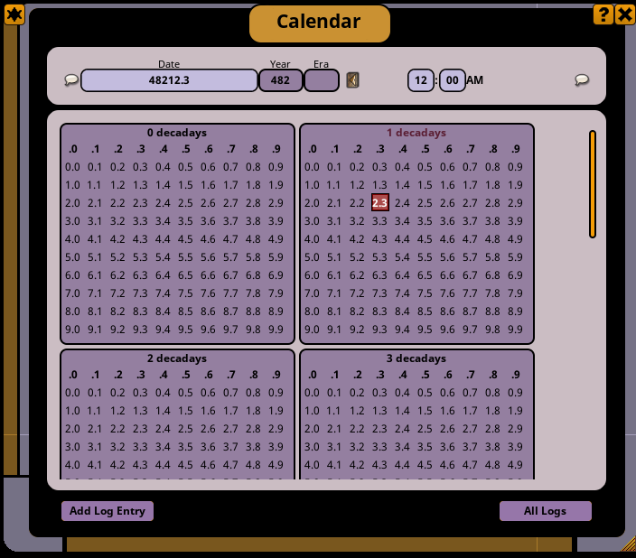

# Simple Stardate Calendar for Fantasy Grounds

A very simple Star Trek Stardate-inspired calendar for Fantasy Grounds.
It may also be used for other "metric" calendar needs.

This calendar takes a simple approach to Stardates given the assumptions
of a Fantasy Grounds calendar.

Fantasy Grounds assumes years/months/days and doesn't provide a lot of
ways to easily replace, reformat, or otherwise augment the time of day.
(It assumes 12-hour AM/PM time as the only supported option.) To fit
Stardates into this formula and help them feel their iconic selves,
the calendar shows weeks of decidays organized into 10 months of decadays
for "star years" here of 100 days (one centiday).

It should be just as easy to use this calendar for any style of Stardate
if you adjust to the right FG "year" for your campaign.

Rules of thumb/fun facts:

- If a day is nearly an Earth day then a deciday is roughly 2.4 hours,
  each "week" here is one day, each "month" of decadays is a little over
  week (10 days), and each "year" of centidays is only a bit more than
  three months (100 days).
- The TNG rule of thumb allocated 1,000 days (1 kiloday) for each season,
  which implies either that either a seasons took just shy of 3 real
  world years or that a Stardate day was possibly a third shorter if a
  kiloday acted like a real world year.
